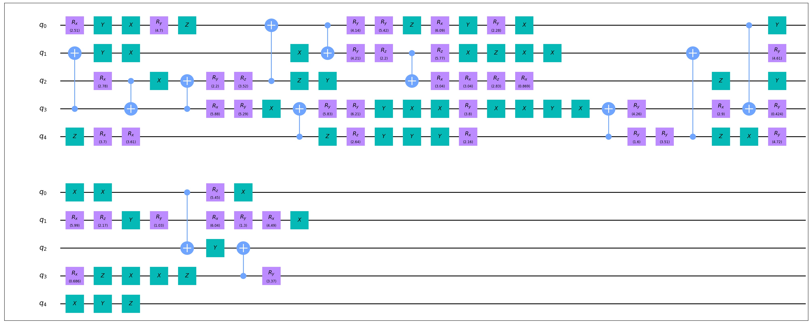
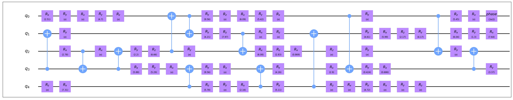

Commutative Optimization
==============================

A basic thought of optimization is to merge the adjacent gates of the same type, while the adjacency
is worth analyzing carefully due to the commutative relation between quantum gates.

Example(Commutative Optimization)
----------------------------------------

Here is an example on the usage of this model.

.. code-block:: python
    :linenos:

    from QuICT.core import *
    from QuICT.qcda.optimization.commutative_optimization import CommutativeOptimization

    # Be aware that too many types at the same time may not benefit to the test,
    # unless the size of the random circuit is also large.
    typelist = [GATE_ID['Rx'], GATE_ID['Ry'], GATE_ID['Rz'],
                GATE_ID['X'], GATE_ID['Y'], GATE_ID['Z'], GATE_ID['CX']]

    if __name__ == '__main__':
        circuit = Circuit(5)
        circuit.random_append(rand_size=100, typeList=typelist)
        circuit.draw()

        gates = CommutativeOptimization.execute(circuit)
        circuit_opt = Circuit(5)
        circuit_opt.set_exec_gates(gates)
        circuit_opt.draw()

In this code we randomly add 100 gates to a circuit with 5 qubits and try to optimize the circuit,
where the types of gates are limited to the *typelist*. A random circuit and its optimization
result are as follows.

Random circuit:

Circuit after optimization:

Limitation
--------------------

Because there is no automated process to calculate the merge result of given two gates, the type of
gates in the input circuit is strictly restricted.

Supported gates: 
H, X, Y, Z, CX, CY, CZ, CH, CCX, Swap,
U1, Rx, Ry, Rz, Phase, CRz, CU1, FSim, Rxx, Ryy, Rzz,
Unitary,
SX, SY, S, S_dagger, T, T_dagger,
SW, U2, U3, CU3

The order stands for the different merge regulation, check the source code for more details.
