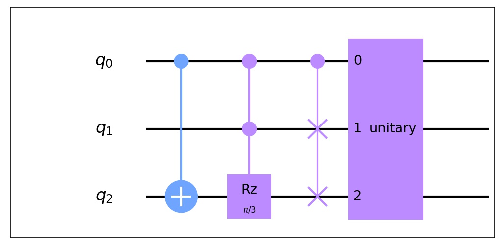
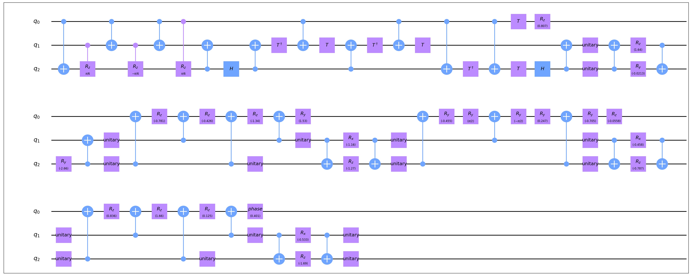

Gate Decomposition
===================

A quantum circuit may contains various kinds of gates. This method provides a direct process to
decompose the 'complicated' gates in a given Circuit/CompositeGate/qasm_file to 'basic' gates.

Example(Gate Decomposition)
-----------------------------

Here is an example on the usage of this model.

.. code-block:: python
    :linenos:

    import numpy as np
    from scipy.stats import unitary_group

    from QuICT.core import *
    from QuICT.qcda.synthesis.gate_decomposition import GateDecomposition

    if __name__ == "__main__":
        circuit = Circuit(3)
        CX | circuit([0, 2])
        CCRz(np.pi / 3) | circuit([0, 1, 2])
        CSwap | circuit([0, 1, 2])
        matrix = unitary_group.rvs(2 ** 3)
        Unitary(matrix) | circuit([0, 1, 2])
        circuit.draw()

        gates_decomposed = GateDecomposition.execute(circuit)
        circuit_decomposed = Circuit(3)
        circuit_decomposed.set_exec_gates(gates_decomposed)
        circuit_decomposed.draw()

In this code we create a circuit with 4 gates and decompose it, the original circuit and the
decomposed circuit are as follows.

The original circuit:

The decomposed circuit:

In the circuit, *CCRz* and *CSwap* are *ComplexGate* decomposed with given *build_gate* methods
while the *Unitary* is decomposed with the *UnitaryTransform* method. Check
:doc:`unitary_transform` for more details.
