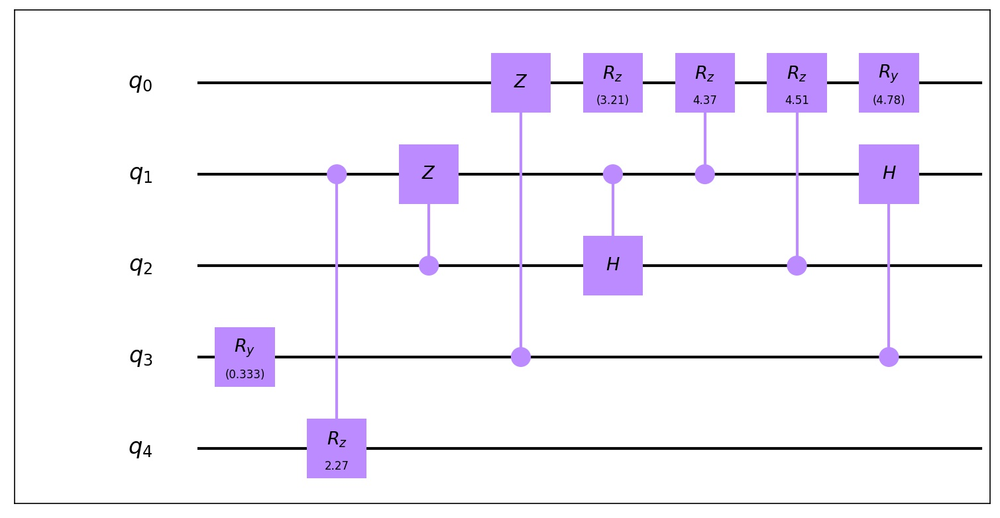
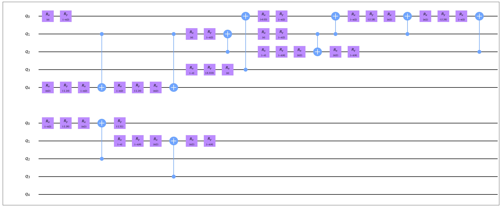

Gate Transform
=================

Gate Transform is a model that transform quantum gates into specified
instruction set which used by different institutions(including IBMQ, Google,
USTC, IonQ) by fixed rules. Also, developers can build their instruction set as well as long as
the instruction set is universal and use **one kind of 2-qubit gate** and
**1-qubit gates**.

In fact, these instruction set contain only one 2-qubit gate and some 1-qubit
gate. for example, IonQ's standard instruction set contain:

- one qubit gates: Rx, Ry, Rz
- two qubit gate: Rxx

Example
--------------
Another example is USTCSet, which contain **CX, Rx, Ry, Rz, H, X**.\
it's easy to use GateTransform to get a compositeGate by setting parameters as
USTCSet

.. code-block:: python
    :linenos:

    from QuICT.core import *
    from QuICT.qcda.synthesis.gate_transform import *

    if __name__ == "__main__":
        circuit = Circuit(5)
        circuit.random_append(10)
        circuit.draw()
        compositeGate = GateTransform(circuit, USTCSet)

        new_circuit = Circuit(5)
        new_circuit.set_exec_gates(compositeGate)
        new_circuit.draw()

Before transform, the circuit has a wide variety of gates(10):

After transform, the circuit only contain gates in USTCSet.

Overview
--------------
GateTransform contain 2 important classes:

- TransformRule
- InstructionSet

As the name implies, class TransformRule describe the rule for transformation
between 2 kind of gates, including transforming a 2-qubit gate into a few
2-qubit gate and transforming a 2*2 unitary into a universal set of
1-qubit gates.

InstructionSet means a universal set which describe a
gates' set, including IBMQSet, USTCSet and so on(instances of InstructionSet).
The instance of InstructionSet contain the information of 2-qubit gate and
1-qubit gates. Also, they may contain some fixed rules of gates' transformation.

TransformRule
--------------
The Rule describe 2-qubits gates transformation.

2-qubit transform rule
^^^^^^^^^^^^^^^^^^^^^^^^^^^^^^^^^^^^
In file **two_qubit_gate_rules.py**, a series of function describe the
transform rule between 2-qubit gates. For example, a rule transform CX gate
into CY gate is described as:

.. code-block:: python
    :linenos:

    def _cx2cy_rule(gate):
        targs = gate.affectArgs
        compositeGate = CompositeGate()
        with compositeGate:
            S & targs[1]
            CY & targs
            S_dagger & targs[1]
        return compositeGate
    Cx2CyRule = TransformRule(_cx2cy_rule, CX, CY)

When initial a 2-qubit transform rule, one should pass the transformation
function, source gate and target gate.

SU2_rule
^^^^^^^^^^^^^^^^^^
In file **SU2_rule.py**, there types of 1-qubit gates' transformation rules are
given, for their particularity, a subClass **SU2TransformRule** is created for
them.

An example of SU2_rule is like this:

.. code-block:: python
    :linenos:

    def _zyzRule(gate):
        """ decomposition the unitary gate with 2 * 2 unitary into Rz Ry Rz sequence
        Args:
            gate(Unitary): the gate to be decomposed

        Returns:
            compositeGate: a list of compositeGate
        """
        unitary = gate.matrix
        targ = gate.targ
        eps = 1e-13

        det = linalg.det(unitary)
        beta_plus_delta = 0
        beta_dec_delta = 0
        if abs(det - 1) > eps:
            unitary[:] /= np.sqrt(det)

        if abs(unitary[0, 0]) > abs(unitary[0, 1]) > eps:
            gamma = _arccos((2 * (unitary[0, 0] * unitary[1, 1]).real - 1))
        else:
            gamma = _arccos((2 * (unitary[0, 1] * unitary[1, 0]).real + 1))
        if abs(unitary[0, 0]) > eps:
            beta_plus_delta = -np.angle(unitary[0, 0] / np.cos(gamma / 2)) * 2
        if abs(unitary[0, 1]) > eps:
            beta_dec_delta = np.angle(unitary[1, 0] / np.sin(gamma / 2)) * 2

        beta = (beta_plus_delta + beta_dec_delta) / 2
        delta = beta_plus_delta - beta
        compositeGate = CompositeGate()
        with compositeGate:
            if not _check2pi(delta):
                Rz(delta) & targ
            if not _check2pi(gamma):
                Ry(gamma) & targ
            if not _check2pi(beta):
                Rz(beta) & targ
        return compositeGate

    ZyzRule = SU2TransformRule(_zyzRule)

InstructionSet
--------------
Contain the information of 2-qubit gate and 1-qubit gates. Developers should
pass the 2-qubit gate and 1-qubits gates to build an instance.

Or developers can also use the preset set: **IBMQSet, USTCSet, IonQSet,
GoogleSet**.

.. code-block:: python
    :linenos:

    buildSet = InstructionSet([CY, Rz, Ry])

Developer can register the rule by calling function, otherwise algorithm will call
the default rules. **Once developer register the transform rule, the corresponding default rule will be replaced**
**if exists.**

.. code-block:: python
    :linenos:

    buildSet.register_SU2_rule(ZyzRule)
    buildSet.register_rule_map(Cx2CyRule)

One can call function **select_transform_rule** to get a the 2-qubit
TransformRule and use property **SU2_rule** to get the 1-qubit TransformRule.

.. code-block:: python
    :linenos:

    def select_transform_rule(self, source) ->  TransformRule:
        """ choose a rule which transforms source gate into target gate(2-qubit)

        Args:
            source(BasicGate/int): the id of source gate

        Returns:
            TransformRule: the transform rules
        """

    @property
    def SU2_rule(self) -> TransformRule:
        """ the rule of decompose 2*2 unitary into target gates

        Returns:
            TransformRule: the corresponding rule
        """

The Core Code
--------------
The GateTransform first call 2-qubit gate's TransformRule to make all 2-qubit
gates into target set. And then use the rule of decompose 2*2 unitary to make
continuous 1-qubit gate(s) into a few gates in target set.

.. code-block:: python
    :linenos:

    def _two_qubit_transform(source, instruction_set):
        """ transform source gate into target gate with function

        if function is None, find the default rule

        Args:
            source(BasicGate): the source gate
            instruction_set(InstructionSet): the target instruction set

        Returns:
            TransformRule: the gate list which contains only 2-qubit gates in target instruction set and one qubit gates
        """
        return instruction_set.select_transform_rule(source)

    compositeGate = CompositeGate(circuit if isinstance(circuit, CompositeGate) else circuit.gates, with_copy = False)

    # transform 2-qubits gate
    compositeGateStep1 = CompositeGate()
    for gate in compositeGate:
        if gate.targets + gate.controls > 2:
            raise Exception("gate_transform only support 2-qubit and 1-qubit gate now.")
        if gate.type() != instruction_set.two_qubit_gate and gate.targets + gate.controls == 2:
            rule = instruction_set.select_transform_rule(gate)
            compositeGateStep1.extend(rule.transform(gate))
        else:
            compositeGateStep1.append(gate)

    # transform one qubit gate
    compositeGateStep2 = CompositeGate()
    unitaries = [np.identity(2, dtype=np.complex128) for _ in range(circuit.circuit_width())]
    for gate in compositeGateStep1:
        if gate.targets + gate.controls == 2:
            targs = gate.affectArgs
            compositeGateStep2.extend(instruction_set.SU2_rule.transform(Unitary(unitaries[targs[0]]) & targs[0]))
            compositeGateStep2.extend(instruction_set.SU2_rule.transform(Unitary(unitaries[targs[1]]) & targs[1]))
            unitaries[targs[0]] = np.identity(2, dtype=np.complex128)
            unitaries[targs[1]] = np.identity(2, dtype=np.complex128)
            compositeGateStep2.append(gate)
        else:
            unitaries[gate.targ] = np.dot(gate.matrix, unitaries[gate.targ])
    for i in range(circuit.circuit_width()):
        compositeGateStep2.extend(instruction_set.SU2_rule.transform(Unitary(unitaries[i]) & i))
    return compositeGateStep2
