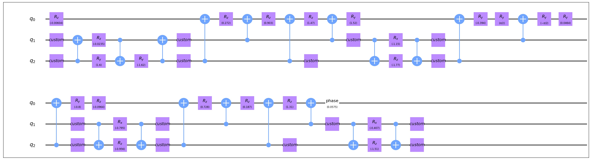

Unitary Transform
===================

As is known that any quantum circuit on :math:`n` qubits corresponds to a unitary matrix
:math:`U\in SU(2^n)`. Unitary transform is a model that transforms a given unitary 
matrix :math:`U\in SU(2^n)` to a :math:`n`-qubit quantum circuit which only contains
:math:`R_{x,y,z}` and CNOT gates.

Example
-------------------
Here is a simple usage of this model.

.. code-block:: python
    :linenos:

    import numpy as np

    from QuICT.core import *
    from QuICT.qcda.synthesis.unitary_transform import *

    def generate_unitary(n):
        detM = 0
        while np.isclose(detM, 0, rtol=1.0e-13, atol=1.0e-13):
            A = np.random.randn(n, n)
            B = np.random.randn(n, n)
            M = A + 1j * B
            detM = np.linalg.det(M)
        U, _, _ = np.linalg.svd(M)
        return U

    if __name__ == '__main__':
        U = generate_unitary(2 ** 3)
        compositeGate = UTrans(U)

        circuit = Circuit(3)
        circuit.set_exec_gates(compositeGate)
        circuit.draw_photo(show_depth=False)

Function **generate_unitary** returns a random unitary matrix. Here we generates a random 
:math:`8\times 8` matrix :math:`U\in SU(2^3)`, and transforms it to a :math:`3`-qubit 
quantum circuit.

In the result figure above, custom gates are :math:`1`-qubit gates defined by certain
:math:`SU(2)` matrices.

Result
-------------------
The algorithm implemented here would return a **CompositeGate** with :math:`\frac{23}{48}4^n
-\frac{3}{2}2^n+\frac{4}{3}` CNOT gates and some :math:`1`-qubit gates.([1], Table 1) The lower 
bound of the number of CNOT gates is proved to be :math:`\frac{1}{4}(4^n-n-1)`.([4], Prop. 4.1)

Principle
-------------------
The transform process mainly consists of two parts:

First, we recursively decompose the unitary matrix to CNOT gates, :math:`1`-qubit gates and 
:math:`SU(4)` matrices with quantum Shannon decomposition and decomposition of 
multiplexed-:math:`R_{y,z}` gates.([1], Thm. 8, 10, 13)

Then, we decompose the remaining :math:`SU(4)` matrices to :math:`3` CNOT gates and some 
:math:`1`-qubit gates with Cartan KAK decomposition.([2], 3.2)

After that, we revise the process of decomposition of multiplexed-:math:`R_y` gates ([1], 
Appendix A) and Cartan KAK decomposition ([3], Prop. IV.3, V.2) to reduce the coefficient 
of :math:`4^n` in the number of CNOT gates from :math:`\frac{9}{16}` to :math:`\frac{23}{48}`. 

Reference
-------------------
[1] https://arxiv.org/abs/quant-ph/0406176

[2] https://arxiv.org/abs/0806.4015

[3] https://arxiv.org/abs/quant-ph/0308033

[4] https://ieeexplore.ieee.org/document/1269020
