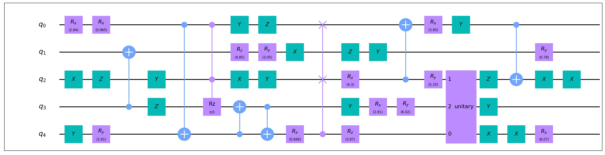
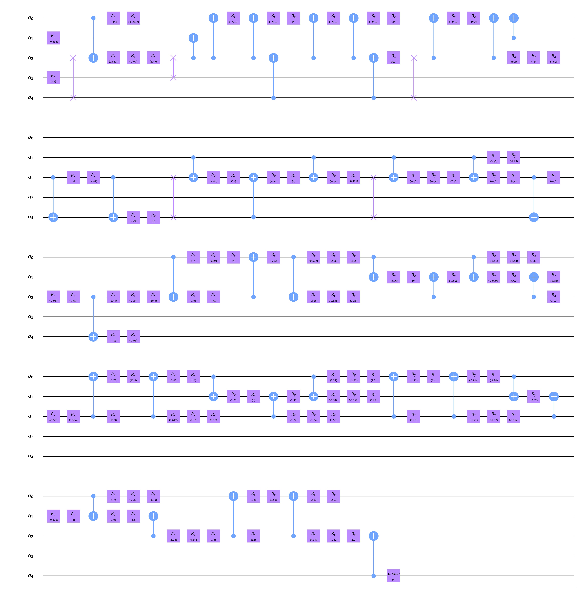

QCDA-flow
====================

Quantum Circuit Design Automation (QCDA for short) combines Synthesis, Optimization and Mapping
into a one-stop process to compile a quantum logic circuit to a quantum physical circuit that
could be executed on a quantum computer with given InstructionSet and Layout.

QCDA(Example)
--------------------

Here is an example on the usage of this model.

.. code-block:: python
    :linenos:

    from scipy.stats import unitary_group

    from QuICT.core import Circuit, Layout
    from QuICT.qcda.synthesis.gate_transform import *
    from QuICT.qcda.qcda import QCDA

    typelist = [GATE_ID['Rx'], GATE_ID['Ry'], GATE_ID['Rz'], GATE_ID['X'], GATE_ID['Y'], GATE_ID['Z'], GATE_ID['CX']]

    if __name__ == '__main__':
        layout = Layout.load_file("../layout/ibmqx2.layout")

        circuit = Circuit(5)
        circuit.random_append(typeList=typelist)
        target = random.sample(range(5), 3)
        CCRz(np.pi / 3) | circuit(target)
        circuit.random_append(typeList=typelist)
        target = random.sample(range(5), 3)
        CSwap | circuit(target)
        circuit.random_append(typeList=typelist)
        matrix = unitary_group.rvs(2 ** 3)
        target = random.sample(range(5), 3)
        Unitary(matrix) | circuit(target)
        circuit.random_append(typeList=typelist)
        circuit.draw()

        qcda = QCDA()
        circuit_phy = qcda.compile(circuit, USTCSet, layout)
        circuit_phy.draw()

In this code we randomly generate a quantum logic circuit with 40 basic gates and 3 other gates
and compile it with the preset default process and generate a corresponding quantum physical
circuit.

Random quantum logic circuit:

Corresponding quantum physical circuit:

